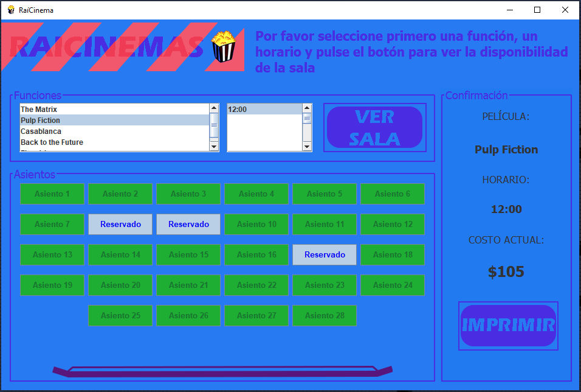

# Simple Reservation System  
  
    
  
### Content
***

* [About this](#about-this) 
* [Build with](#build-with)
* [Basic review](#basic-review)

### About this
I think this example is a good guide to show some simple things. 
### Build with  
[NetBeans](https://github.com/apache/netbeans)  
### Basic review
On this proyect we can see things in a basic way like:  
  
* Login interface  
* Printing  
* Connection to DB  
* Mouse Events  
* Key Events  
* Window Events  

